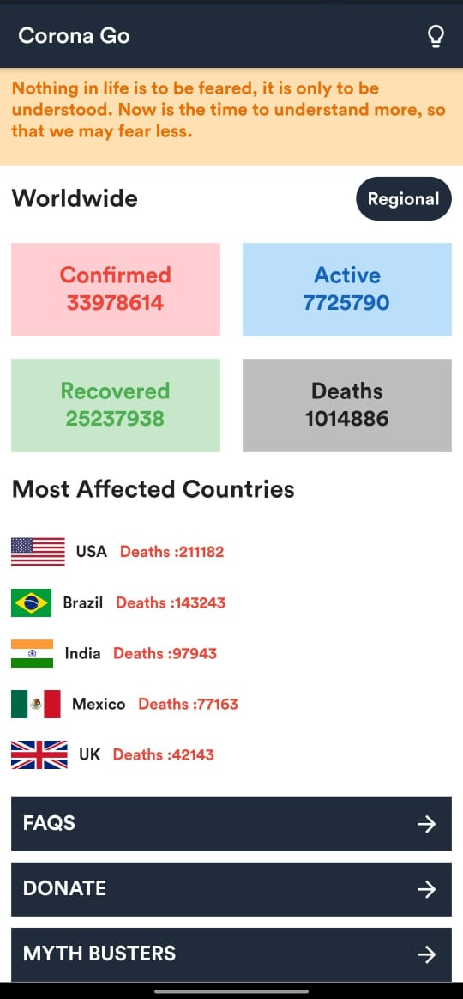
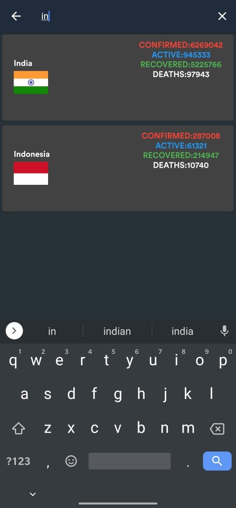

# Corona Go
This is a Corona Virus data tracking application made using Flutter which gives realtime stats of COVID-19 from all the countries.

# This app includes:
 
 
 

# API used:
https://corona.lmao.ninja/v3/covid-19/countries
 
 
 

 
 
 
 

